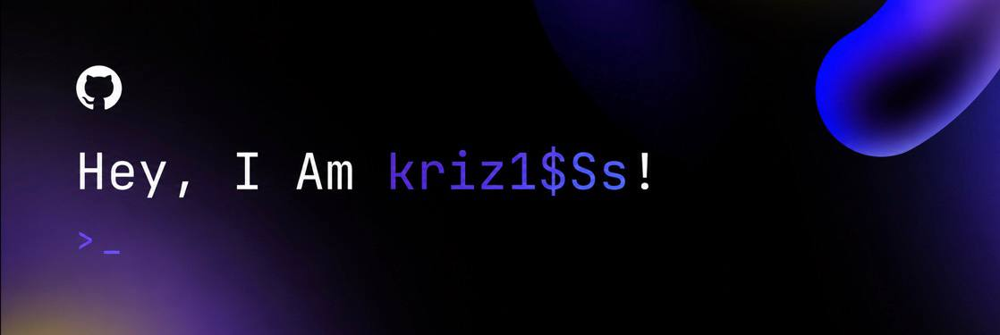

  

<h1 align="center">👋 Привет, я Kriz1ss</h1>

  

---

### 🚀 Обо мне

- 🔥 Full-stack разработчик с душой open-source
- 🧠 Постоянно учусь новому и улучшаю свой код
- 🌍 Работаю удалённо из Москвы
- 🎯 Цель: создавать продукты, которые делают жизнь проще
- ⚡ В свободное время — копаюсь в pet-проектах или читаю техническую литературу

---

### 🛠️ Мой стек

  

---

### 📫 Связь со мной

  
  
  

---

  

  <i>“Code is poetry written for machines, but read by humans.”</i>

